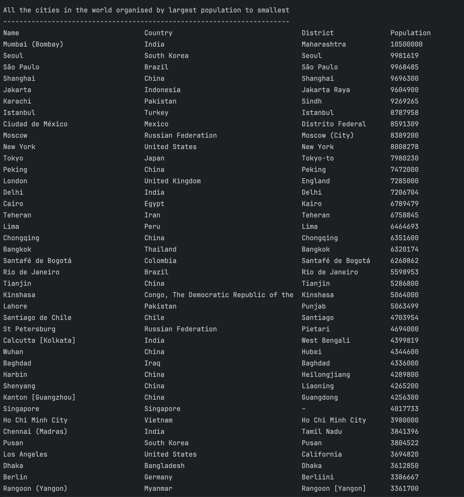
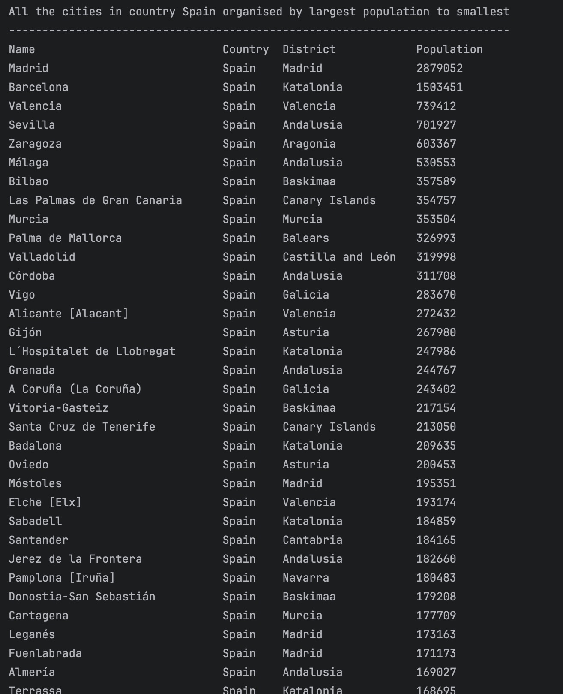
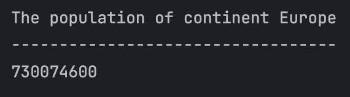

# Scrum Team Two's Group repository

* Master Build Status 
* Develop Branch Status 
* 
* License 
* Release 

## Product Backlog

| ID | Name                                                                                                                                               | Met | Screenshot                                  |
|----|----------------------------------------------------------------------------------------------------------------------------------------------------|-----|---------------------------------------------|
| 1  | All the countries in the world organised by largest population to smallest.                                                                        | Yes |             |
| 2  | All the countries in a continent organised by largest population to smallest.                                                                      | Yes |         |
| 3  | All the countries in a region organised by largest population to smallest.                                                                         | Yes |            |
| 4  | The top `N` populated countries in the world where `N` is provided by the user.                                                                    | Yes |          |
| 5  | The top `N` populated countries in a continent where `N` is provided by the user.                                                                  | Yes |      |
| 6  | The top `N` populated countries in a region where `N` is provided by the user.                                                                     | Yes |         |
| 7  | All the cities in the world organised by largest population to smallest.                                                                           | Yes |                |
| 8  | All the cities in a continent organised by largest population to smallest.                                                                         | Yes |            |
| 9  | All the cities in a region organised by largest population to smallest.                                                                            | Yes |               |
| 10 | All the cities in a country organised by largest population to smallest.                                                                           | Yes |              |
| 11 | All the cities in a district organised by largest population to smallest.                                                                          | Yes |             |
| 12 | The top `N` populated cities in the world where `N` is provided by the user.                                                                       | No  |                                 |
| 13 | The top `N` populated cities in a continent where `N` is provided by the user.                                                                     | No  |                                 |
| 14 | The top `N` populated cities in a region where `N` is provided by the user.                                                                        | No  |                                 |
| 15 | The top `N` populated cities in a country where `N` is provided by the user.                                                                       | No  |                                 |
| 16 | The top `N` populated cities in a district where `N` is provided by the user.                                                                      | No  |                                 |
| 17 | All the capital cities in the world organised by largest population to smallest.                                                                   | Yes |         |
| 18 | All the capital cities in a continent organised by largest population to smallest.                                                                 | Yes |     |
| 19 | All the capital cities in a region organised by largest to smallest.                                                                               | Yes |        |
| 20 | The top `N` populated capital cities in the world where `N` is provided by the user.                                                               | Yes |      |
| 21 | The top `N` populated capital cities in a continent where `N` is provided by the user.                                                             | Yes |  |
| 22 | The top `N` populated capital cities in a region where `N` is provided by the user.                                                                | Yes |     |
| 23 | The population of people, people living in cities, and people not living in cities in each continent.                                              | Yes |   |
| 24 | The population of people, people living in cities, and people not living in cities in each region.                                                 | Yes |      |
| 25 | The population of people, people living in cities, and people not living in cities in each country.                                                | Yes |     |
| 26 | The population of the world.                                                                                                                       | Yes |              |
| 27 | The population of a continent.                                                                                                                     | Yes |          |
| 28 | The population of a region.                                                                                                                        | Yes |             |
| 29 | The population of a country.                                                                                                                       | Yes |            |
| 30 | The population of a district.                                                                                                                      | Yes |           |
| 31 | The population of a city.                                                                                                                          | Yes |               |
| 32 | Total number of people, with percentage of world population, who speak Chinese, English, Hindi, Spanish, Arabic, from greatest number to smallest. | No  |                                 |

## Individual Contribution Spreadsheet

| Matriculation Number | Code Review 1 | Code Review 2 |
| ---- | ------------- | ------------- |
| 40523517 | 25          | 25          |
| 40682709 | 25          | 25          |
| 40676261 | 25          | 25         |
| 40665440 | 25          | 25           |
| 40683872 | 0 | 0 |
| 40682714 | 0 | 0 |
| **Total** | **100** | **100** |
